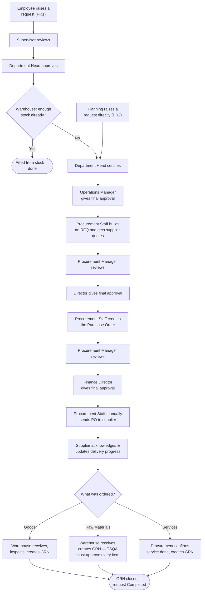

# Fortune Procurement System — End-to-End Walkthrough

**A plain-language guide to how a request moves through the system, from the moment someone asks for something, to the moment it arrives and is checked in.**

---

## The Big Picture

Think of the system as a relay race. One person raises a request, and it's handed off — automatically, with a notification each time — to the next person responsible for the next step. Nobody has to phone or email anyone to ask "what's the status?" because the system shows it in real time.

There are two ways a request can **start** — an **Employee** noticing something is needed, or **Planning** raising a raw-material (or some service) request directly, since they've already done their own forecasting. Both starting points join the **same road** afterward: internal sign-off → finding and comparing suppliers → a formal Purchase Order → the supplier delivering → someone checking in what arrived.

Every table below reads the same way: **Step**, **who does it**, **what happens**.

---

## The Cast of Characters

| Who | Their part in the story |
|---|---|
| **Employee** | Notices something is needed and raises the request |
| **Planning** | Raises raw-material and some service requests directly (skips the first internal check, since they already planned it) |
| **Supervisor** | First reviewer for an Employee's request |
| **Department Head** | Approves the request, and later certifies the purchasing paperwork |
| **Warehouse** | Checks existing stock, and later receives and inspects deliveries |
| **Operations Manager** | Gives final internal sign-off before sourcing begins |
| **Procurement Staff** | Shops around for suppliers, prepares the quotation comparison, creates the Purchase Order, sends it to the supplier |
| **Procurement Manager** | Reviews Procurement Staff's work before it goes to final approval |
| **Director** | Gives final approval on supplier selection |
| **Finance Director** | Gives final approval on the Purchase Order itself |
| **Supplier** | The outside company selling the goods or service |
| **TSQA** (Quality Assurance) | Tests and approves raw materials, and any goods flagged for quality checking |

**At every approval step in every table below, the reviewer has exactly three choices:** Approve (move forward), Reject (close the request, requestor is told why), or Request Revision (send it back one step for a fix, then it re-enters the same stage).

---

## Part 1 — Starting the Request

There are two starting points. Every request begins with one of these two tables — never both.

### 1A. An Employee raises a request

**Example:** Maria in Finance needs a case of printer toner.

| Step | Who | What happens |
|---|---|---|
| 1 | **Employee** | Logs in, goes to **My Requests**, creates a new request (a **PR1**) — what's needed, how many, and by when — and submits it |
| 2 | **Supervisor** | Reviews the request |
| 3 | **Department Head** | Approves the request |
| 4 | **Warehouse** | Checks whether we already have enough in stock |
| 4a | *(if yes)* | Filled directly from existing stock — **the journey ends here** |
| 4b | *(if no)* | Warehouse creates the next document, a **PR2**, and the request moves on to Procurement — **continue to Part 2** |

### 1B. Planning raises a request directly

**Example:** Planning knows next month's production run needs a large batch of adhesive, based on their own forecasting.

| Step | Who | What happens |
|---|---|---|
| 1 | **Planning** | Creates a **PR2** directly — no PR1, no Supervisor/Department Head review at this stage, no warehouse stock check, since Planning has already done the equivalent homework themselves |

Planning can also use this same direct route for certain **services** (e.g., machine servicing), the same way it works for raw materials.

Whichever way the PR2 was created — Warehouse (from Part 1A) or Planning directly (Part 1B) — it now follows the identical journey in Part 2.

---

## Part 2 — Internal Sign-Off on the PR2

Before Procurement is allowed to spend a single peso shopping for suppliers, two people internally certify that the request is legitimate and necessary.

| Step | Who | What happens |
|---|---|---|
| 1 | **Department Head** | Certifies the PR2 |
| 2 | **Operations Manager** | Gives the final internal approval — the moment this happens, **Procurement is automatically notified** that the request is ready for sourcing |

---

## Part 3 — Procurement Shops Around (the RFQ)

An RFQ (Request for Quotation) is Procurement's invitation to two or more suppliers to quote a price for exactly what's needed.

| Step | Who | What happens |
|---|---|---|
| 1 | **Procurement Staff** | Builds the RFQ and invites suppliers to quote |
| 2 | **Supplier(s)** | Submit their quotes through their own supplier portal |
| 3 | **Procurement Staff** | Lays every supplier's quote side-by-side (price, lead time, notes) and picks the winning quote for each item |
| 3a | *(if a supplier offers a substitute item)* | The substitute is flagged and shown side-by-side with the original; either the requestor **or** Procurement accepting it is enough to move it forward |
| 4 | **Procurement Manager** | Reviews the canvassing results |
| 5 | **Director** | Gives final approval — the moment this happens, **Procurement Staff is notified** that the Purchase Order can now be created |

---

## Part 4 — The Purchase Order (PO)

| Step | Who | What happens |
|---|---|---|
| 1 | **Procurement Staff** | Creates the formal Purchase Order — the official document committing the company to buy from the selected supplier(s) at the agreed price |
| 2 | **Procurement Manager** | Reviews the PO |
| 3 | **Finance Director** | Gives final approval — the last checkpoint before money is committed |
| 4 | **Procurement Staff** | **Manually** clicks "Send to Supplier" — this is a deliberate safeguard; the PO is never sent automatically, even after approval |

---

## Part 5 — Supplier Delivers

| Step | Who | What happens |
|---|---|---|
| 1 | **Supplier** | Acknowledges the PO and commits to a delivery date |
| 2 | **Supplier** | Updates delivery progress as it happens (preparing, in transit, delivered) — visible in real time to Procurement, Warehouse, and the original requestor |

---

## Part 6 — Receiving and Checking It In (the GRN)

What happens here depends on **what** was ordered. Only one of the three rows below applies to any given request.

| Type of request | Who | What happens |
|---|---|---|
| **Ordinary Goods** | Warehouse | Receives the delivery, inspects each item against the delivery paperwork, creates the Goods Receipt Note (GRN); any specific item can optionally be flagged for a quality check |
| **Raw Materials** | Warehouse → **TSQA** | Same receiving process, but **every single item must pass a quality check before the GRN can close** — not optional, unlike ordinary goods |
| **Services** | **Procurement** (not Warehouse) | Confirms the service was completed and creates the GRN; if supporting paperwork is required (e.g. a Certificate of Calibration), the supplier uploads it and Procurement cannot finalize receipt until it's in |

| Final step | Who | What happens |
|---|---|---|
| Last | Warehouse *or* Procurement (whichever prepared the GRN) | Closes the GRN once everything is resolved and prints the finalized copy — **journey complete**. The original requestor now sees their request as **Completed** |

---

## The Whole Journey at a Glance

---

## A Few Things Worth Knowing

| Point | What it means |
|---|---|
| **Every approval checkpoint has exactly three outcomes** | Approve, Reject, or Request Revision — never anything else, at any step in any table above |
| **Nothing happens silently** | Every handoff — a new approval needed, a supplier submitting a quote, a delivery update, a document ready — triggers a notification to whoever needs to act next |
| **Status is always visible** | The original requestor (Employee or Planning) can see exactly where their request stands at any point — waiting on an approver, out for quotes, in transit, or already received |
| **Raw materials get an extra layer of scrutiny** | Every single raw-material unit must be quality-checked by TSQA before it's considered received — there's no discretion involved, unlike ordinary goods where only flagged items get tested |

---

*This guide describes the standard path for each request type. Individual approval steps, positions, and options can be configured over time — if what you see on screen differs slightly from what's described here, that reflects a configuration update, not an error.*
